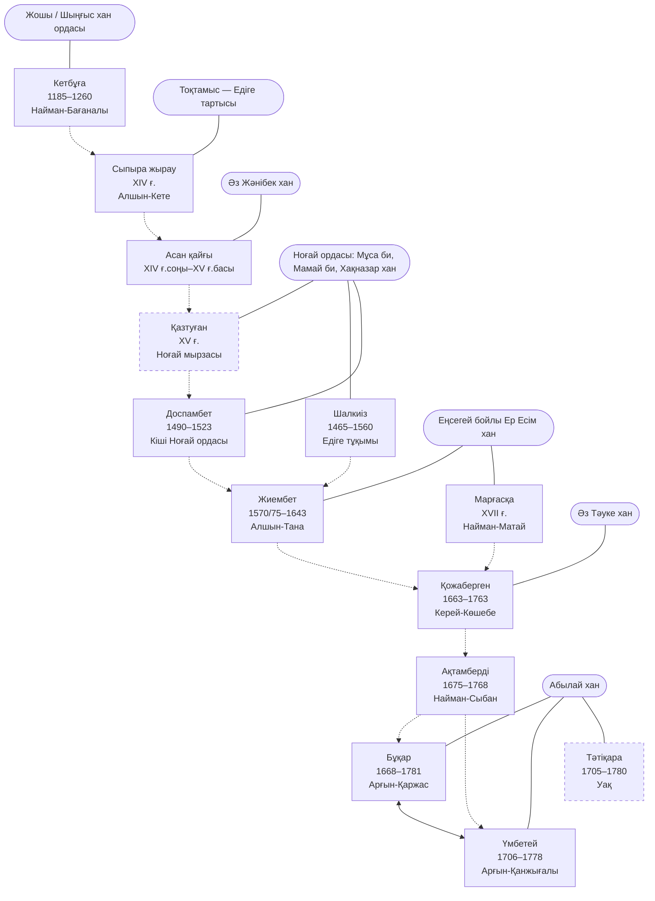
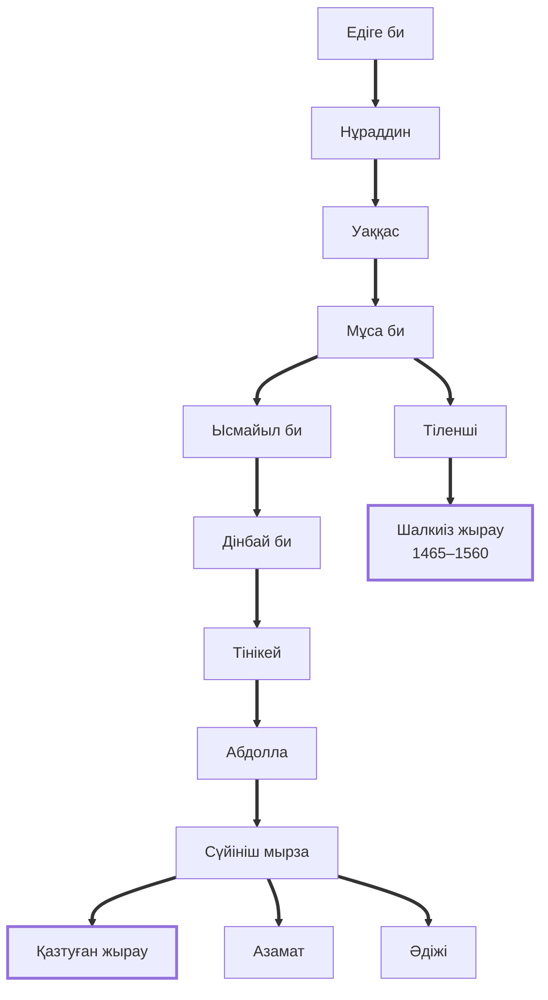
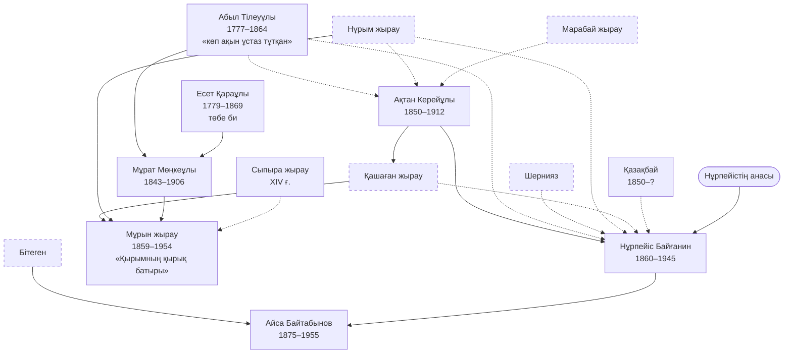
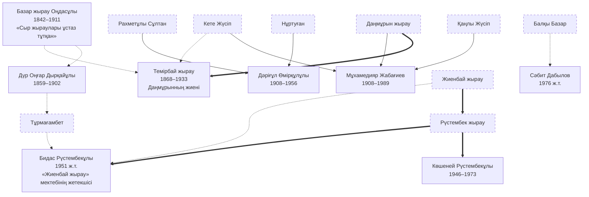
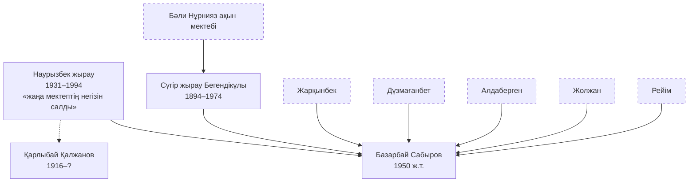
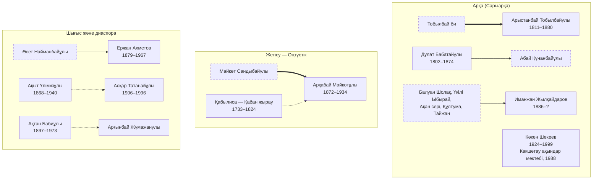
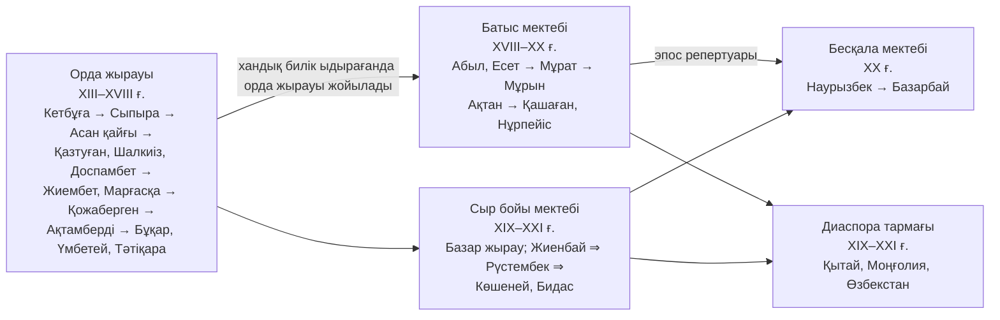

# Қазақ жырауларының шежіре-байланыс сызбасы

Сызбалар [kk.wikipedia «Санат:Қазақ жыраулары»](https://kk.wikipedia.org/wiki/Санат:Қазақ_жыраулары)
санатындағы **61 жыраудың** мақалалары бойынша құрылды (толық кесте:
`zhyraular-tizimi.md`).

> **Оқу алдында.** Уикипедия — осы репозиторийде **V деңгейлі** дереккөз, яғни
> тексеру нысаны. Сызба «жыраулар шын мәнінде осылай байланысқан» дегенді емес,
> **«Уикипедия оларды осылай байланыстырады»** дегенді көрсетеді. Әр байланыстың
> дәйексөзі кестеде тұр.

## Сызбадағы белгілер

| Белгі | Мағынасы |
|---|---|
| `A ==> B` | **Қан-туыстық**: әке-бала, ата-немере, аға-іні |
| `A --> B` | **Ұстаз → шәкірт**: мақалада тікелей «үйренген / шәкірті / ұстаз тұтқан» деп жазылған |
| `A -.-> B` | **Дәстүр жалғастығы**: тікелей ұстаздық емес, «дәстүрін жалғастырған / үлгі алған» |
| Үзік жиек | Уикипедия санатында **жоқ**, бірақ байланыс торабы ретінде қажет тұлға |

---

## 1-сызба. Классикалық жыраулық тізбек (XIII–XVIII ғ.)

Бұл — «мектеп» емес, **билік ордасына бекіген қызмет тізбегі**: әр жырау белгілі бір
хан не билеушінің қасында тұрған. Байланыс ұстаз-шәкірт арқылы емес, **сол қызмет
орнының мұрагерлігі** арқылы жүреді.

**Ең берік буын:** Бұқар ↔ Үмбетей. Мұны Уикипедия да («Үмбетей Бұқармен дос,
құрдас екен»), біздің бастапқы дереккөзіміз де растайды: Үмбетейдің «Бұқарға» деген
арнау жыры бар (`derekter/umbetey-tileuuly/06-buqarga.md`).

**Ең әлсіз буын:** Кетбұға → Сыпыра → Асан қайғы. Мұнда ешқандай ұстаздық дерек жоқ,
тек хронологиялық реттілік. Сызбада үзік сызықпен берілуі сондықтан.

---

## 2-сызба. Едіге шежіресі — жыраулықтың қан-жүйелік арнасы

Бұл — сызбадағы **жалғыз нақты қан-шежіре**. Уикипедия Қазтуғанның тегін толық
тізіп береді, ал Шалкиіз де сол Мұса би тармағынан шығады. Яғни XV–XVI ғасырдағы
екі ірі жырау — **бір әулеттен**.

**Ескерту.** Едіге — Сыпыра жырау жырлаған дәуірдің басты тұлғасы. Демек Сыпыра →
Едіге → (ұрпақтары) → Қазтуған мен Шалкиіз деген тізбекте **жыраулық пен билік бір
әулеттің ішінде айналған**. Бұл — «жырау кім болды?» деген сұраққа жауап:
кәсіби ақын емес, **билеуші әулеттің сөз ұстаған мүшесі**.

---

## 3-сызба. Батыс (Маңғыстау–Атырау) мектебі — ең тығыз тізбек

Бұл — Уикипедия деректері бойынша **ең айқын құжатталған** ұстаз-шәкірт торабы.

**Түйін:** «Қырымның қырық батыры» эпопеясының XX ғасырға жетуі осы тізбекке тікелей
байланысты: **Абыл/Есет → Мұрат → Мұрын**, әрі Қашаған мен Нұрым арқылы. Мұрын
жыраудың өзін **Сыпыра жыраудың ұрпағымын** деп атауы — XIV ғасырдан XX ғасырға
тартылған саналы тізбек талабы (тарихи дәлелденбеген, бірақ дәстүрдің өзін-өзі
қалай түсінгенін көрсетеді).

---

## 4-сызба. Сыр бойы мектебі

**Ерекшелігі:** Батыс мектебі ұстаз-шәкірт арқылы тараса, Сыр бойында **әулеттік
арна басым**: Жиенбай ⇒ Рүстембек ⇒ Көшеней мен Бидас — үш буын, тікелей қан-жалғасы.
Даңмұрын ⇒ Темірбай (нағашы-жиен) да сол қатарда.

---

## 5-сызба. Бесқала (Қарақалпақстан–Хорезм) мектебі

Базарбай Сабыров — **жеті ұстаздың** атын атайтын жалғыз жағдай. Бұл — XX ғасырдағы
жыршылықтың бір ғана ұстазға емес, **өңірлік репертуарға** байланғанын көрсетеді.

---

## 6-сызба. Арқа, Жетісу және диаспора тармақтары

---

## 7-сызба. Жалпы көрініс — төрт арна

**Басты тұжырым:** XVIII ғасырдың соңында хандық билік құлағанда **«орда жырауы»
деген қызмет орны жойылады**. Одан кейінгі жыраулар — билік кеңесшісі емес,
**эпос сақтаушы-орындаушы**. Сондықтан Бұқардан кейін «ханға ақыл айтқан жырау»
типі кездеспейді, оның орнына «Қырымның қырық батырын жырлаған жырау» типі шығады.
Бұл — жыраулық өнердің құлдырауы емес, **функциясының ауысуы**.

---

## Сызбаның шектеулері (ашық айтылады)

1. **Санат толық емес.** Тізбектің 24-ке жуық буыны (Нұрым, Қашаған, Жиенбай,
   Даңмұрын, Кете Жүсіп, Марабай, Қазтуған, Тәтіқара, Шал ақын, т.б.) Уикипедия
   санатына кірмеген. Оларсыз сызба жарамсыз болар еді, сондықтан үзік жиекпен
   қосылды.
2. **Классикалық қабатта ұстаздық дерек жоқ.** Кетбұға–Сыпыра–Асан қайғы–Қазтуған
   арасындағы байланыс тек хронологиялық реттілік. Бұл — сызбадағы ең әлсіз тұс.
3. **Даталар тексерілмеген.** Қазтуған XV ғ. ме, XVII ғ. ме — Уикипедияның өз ішінде
   екі жауап бар. Бұқардың даталары да солай.
4. **Ру-тегі деректері мақала кіріспесінен автоматты алынды**, кейбірі нақтылауды
   қажет етеді.
5. **Күй арнасы сызбада жоқ.** Кетбұға — күйші деп аталады, бірақ күйшілік
   тізбек бөлек зерттеуді қажет етеді (`derekter/kuiler/` әлі бос).

Келесі қадам: осы сызбадағы әр байланысты бастапқы дереккөзбен (жинақтар, шежіре,
М.Мағауин, Ә.Марғұлан зерттеулері) тексеріп, деңгей белгісін қою.
